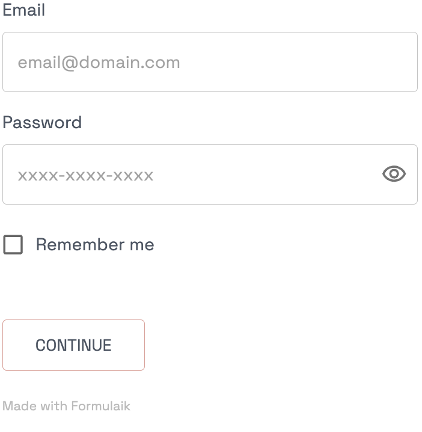
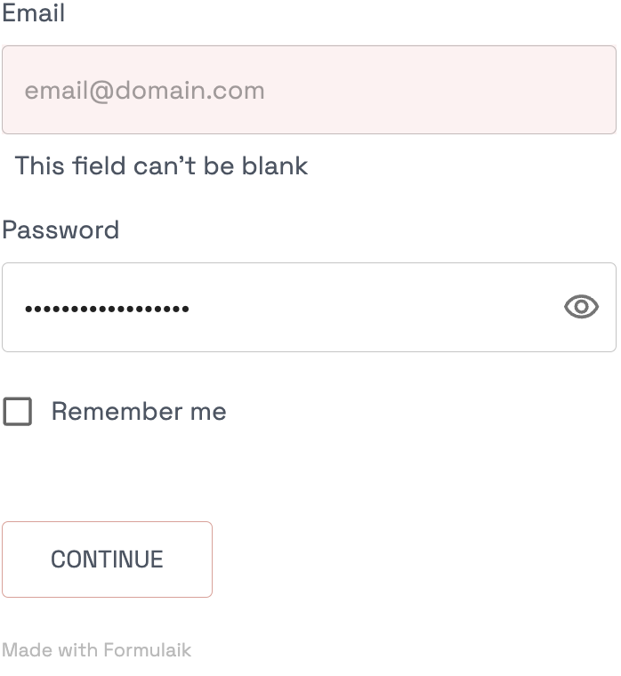

# Usage

In this guide we will use an existing component library that adapts some of the Google Material UI components: [formulaik-mui-react](https://github.com/formulaik-community/formulaik-mui-react).
You can also use your [custom components library](../componentlibrary/overview).

We are going to build this form:



## Declare inputs

An [input](../../concepts/terms#input) is a JSON declaration for formulaik to show a component referenced by a the `component` key.
This is where we define what the form will look like, which components it will include and how each one of them will behave.

```js
const inputs = [
{
      component: 'input',
      id: 'email',
      label: 'Email',
      type: "string",
      params: {  
        placeholder: "email@domain.com"
      },
      validations: [
        {
          kind: "format",
          value: "email",
          message: 'Invalid email format',
        },
        {
          kind: "required",
          value: true,
          message: "This field can't be blank",
        },
      ],
    },
    {
      component: 'inputPassword',
      label: 'Password',
      id: 'password',
      type: "string",
      params: {
        autoComplete: "current-password",
        placeholder: "xxxx-xxxx-xxxx"
      },
      validations: [
        {
          kind: "required",
          value: true,
          message: "This field can't be blank",
        },
        {
          kind: "matches",
          value: /^(?=.*\d)(?=.*[a-z])(?=.*[A-Z])(?=.*[a-zA-Z]).{8,}$/,
          message: 'Invalid password, must contain at least 8 characters and at most 18 characters',
        },
      ]
    },
    {
        component: 'checkbox',  
        id: 'rememberMe',
        type: "boolean",
        params: {
            label: 'Remember me',
        }
    },
    {
      component: 'submit',
      id: 'submit',
      params: {
        text: 'Continue'
      }
    },
]
```

* The input with the `id` "email" tells formulaik

  - to use the `component` with the `email` id
  - to label the `component` *Email*
  - to expect a `string` data type
  - to forward the `params` to the component, namely the *placeholder* customization
  - to use the `validations` rules:
    - `format`: make sure it's an email
    - `required`: this field is required
* The input with the `id` *password* tells formulaik

  - to use the `component` with the `password` id
  - to label the `component` *Password*
  - to expect a `string` data type
  - to forward the `params` to the component, namely the *placeholder* and the *autoComplete* customizations
  - to use the `validations` rules:
    - `required`: this field is required
    - `matches`: this field matches the provided regex, if not, display the error message
* The input with the `id` *rememberMe* tells formulaik

  - to use the `component` with the `checkbox` id
  - to expect a `boolean` data type
  - to forward the `params` to the component, namely the *label* customizations
* The input with the `id` *submit* tells formulaik

  - to use the `component` with the `submit` id
  - to forward the `params` to the component, namely the *text* (label) customizations

As you can see the inputs come as an ordered array and are fed to your Formulaik engine of choice.
They are:

- Platform agnostic
- Language agnostic

## Declare values

`values` are the default values passed to Formulaik.
You need to match the ids provided in the inputs section.
Here is an example with default values being retrieved from cookies storage:

```js
const values = {
  email: cookies.get('email'),
  password: "",
  rememberMe: cookies.get('rememberMe'),
}
```

We will use empty values for this guide:

```js
const values = {
  email: "",
  password: "",
  rememberMe: false,
}
```

Values can also be undefined.

## Handle submission

Formulaik was built to make form submission seamless and easy.
Once all the validations have passed, the `onSubmit` callback is called with the `values` provided by the user and a few extra options:

```js
 const onSubmit = async (values) => {
    const { email, password } = values
    try { 
      await myapi.submit({ email, password })
    }
    catch(e) {
      throw (new Error('Could not sign in: ', e.message))
    }
    return { message: t("Email validated") }  
  }
```

When `onSubmit` is called a few things happen under the hood:

- The form is in the `isSubmitting` state. This means all your components are disabled, and if your `submit` component allows it, it will be in a *loading state*. You have nothing to manage here.
- When everything goes well, you can return a JSON object that contain the `message` field to notify the user the operation succeeded.
- In case of an error, simply throw the error. Formulaik will catch it and notify the user accordingly.

## Putting it all together

```js
import Formulaik from '@formulaik/react'
import FormulaikMui from '@formulaik-community/react-mui'

const inputs = [
  {
    component: 'input',
    id: 'email',
    label: 'Email',
    type: "string",
    params: {  
      placeholder: "email@domain.com"
    },
    validations: [
      {
        kind: "format",
        value: "email",
        message: 'Invalid email format',
      },
      {
        kind: "required",
        value: true,
        message: "This field can't be blank",
      },
    ],
  },
  {
    component: 'inputPassword',
    label: 'Password',
    id: 'password',
    type: "string",
    params: {
      autoComplete: "current-password",
      placeholder: "xxxx-xxxx-xxxx"
    },
    validations: [
      {
        kind: "required",
        value: true,
        message: "This field can't be blank",
      },
      {
        kind: "matches",
        value: /^(?=.*\d)(?=.*[a-z])(?=.*[A-Z])(?=.*[a-zA-Z]).{8,}$/,
        message: 'Invalid password, must contain at least 8 characters and at most 18 characters',
      },
    ]
  },
  {
      component: 'checkbox',  
      id: 'rememberMe',
      type: "boolean",
      params: {
          label: 'Remember me',
      }
  },
  {
    component: 'submit',
    id: 'submit',
    params: {
      text: 'Continue'
    }
  },]
  
export default (props) => {
 const onSubmit = async (values) => {
    const { email, password } = values
    try { 
      await myapi.submit({ email, password })
    }
    catch(e) {
      throw (new Error('Could not sign in: ', e.message))
    }
    return { message: t("Email validated") }  
  }

  const values = {
    email: "",
    password: "",
    rememberMe: false,
  }

  return <>  
      <h3>Login</h3>  
      <Formulaik
        components={[FormulaikMui]}
        values={values}  
        inputs={inputs}
        onSubmit={onSubmit}
         />  
    </>
}
```

We give a few props to the `Formulaik` component:

- `components={[FormulaikMui]}`: a list of component libraries to pick the input components from
- `values={values}`:  Formulaik the default values
- `inputs={inputs}`: the inputs list
- `onSubmit={onSubmit}`: the submission handler

Voilà.

## Screenshots

|      |               | 
| ------------------- | -------------------------- |
|  | Email validation failed  |

